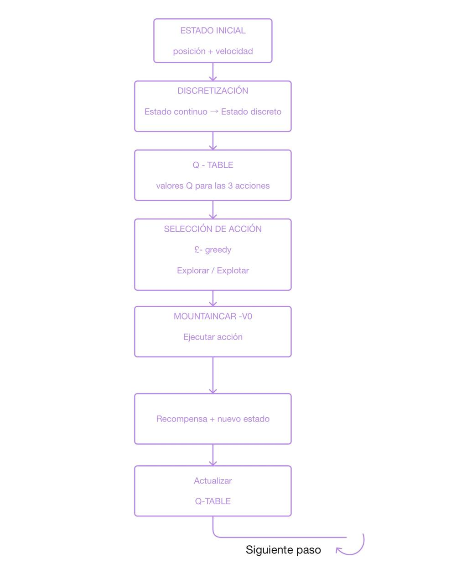
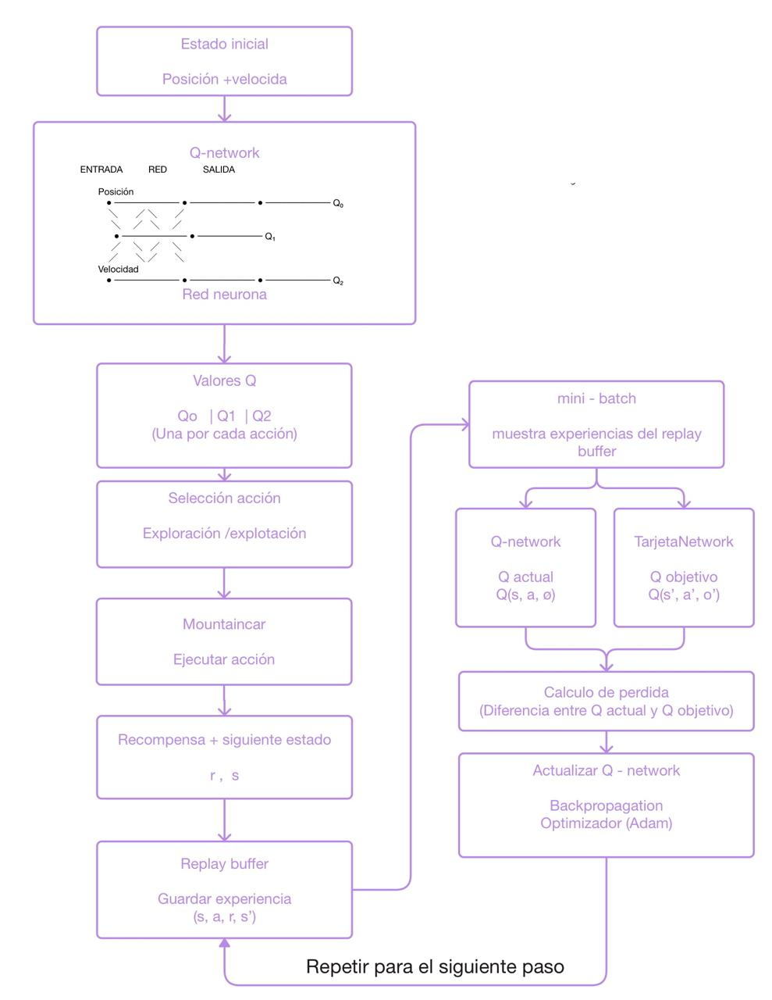

# Reinforcement Learning: MountainCar-v0

## 1. Introducción

Este proyecto implementa y analiza dos algoritmos de aprendizaje por refuerzo para el entorno **MountainCar-v0** de Gymnasium:

- Q-Learning tabular.
- Deep Q-Network (DQN).

El objetivo del entorno es que un automóvil alcance la bandera ubicada en la parte superior de la montaña. Debido a que el motor del automóvil no tiene suficiente potencia para subir directamente, el agente debe aprender a desplazarse hacia ambos lados para generar suficiente impulso.

El proyecto permitió implementar los algoritmos, entrenarlos, evaluar su desempeño y analizar las dificultades de exploración que presenta MountainCar-v0.

---

## 2. Entorno MountainCar-v0

El estado del entorno está compuesto por dos variables continuas:

| Variable | Descripción |
|---|---|
| Position | Posición del automóvil |
| Velocity | Velocidad del automóvil |

El agente dispone de tres acciones:

| Acción | Descripción |
|---|---|
| 0 | Acelerar hacia la izquierda |
| 1 | No acelerar |
| 2 | Acelerar hacia la derecha |

La recompensa es de **-1 por cada paso**. Por lo tanto, una recompensa menos negativa representa un episodio más corto y un mejor desempeño.

El episodio puede durar hasta 200 pasos, por lo que un agente que no alcance la bandera puede obtener una recompensa de aproximadamente **-200**.

Esta característica hace que MountainCar sea un entorno interesante para estudiar aprendizaje por refuerzo, ya que el agente debe descubrir mediante exploración una secuencia de acciones que le permita generar el impulso necesario para alcanzar la meta.

---

## 3. Implementación de Q-Learning

Para Q-Learning se implementó una representación tabular del espacio de estados.

Como la posición y la velocidad son variables continuas, se discretizaron ambos valores para convertirlos en estados discretos.

El proceso general utilizado fue:

**Estado continuo → Discretización → Estado discreto → Q-Table → Selección de acción → Acción en el entorno → Recompensa y nuevo estado → Actualización de Q-Table**

### Componentes implementados

En `src/mountain_car/agents/qlearning.py` se implementaron principalmente:

- Discretización del estado.
- Selección de acciones mediante epsilon-greedy.
- Actualización de los valores Q.
- Entrenamiento y evaluación del agente.

### Entrenamiento

El agente fue entrenado durante **20.000 episodios** mediante el comando:

    uv run mountaincar train qlearning --episodes 20000

### Evaluación

La evaluación final se realizó mediante el comando:

    uv run mountaincar load qlearning --eval

Resultado obtenido:

- Episodios entrenados: **20.100**
- Recompensa promedio: **-144.80 ± 14.65**
- Episodios que alcanzaron la bandera: **10/10**

El agente también fue visualizado mediante:

    uv run mountaincar render qlearning --episodes 3

Los tres episodios observados alcanzaron la bandera.

---

## 4. Implementación de DQN

El segundo enfoque utiliza una **Deep Q-Network (DQN)** para aproximar los valores Q mediante una red neuronal.

La arquitectura utilizada recibe como entrada las dos variables del estado:

- Position
- Velocity

y produce tres valores Q, uno por cada acción disponible.

La red contiene capas ocultas con función de activación ReLU y una capa de salida correspondiente a las tres acciones posibles.

### Componentes implementados

En `src/mountain_car/agents/dqn.py` se implementaron:

- `QNetwork`.
- Experience Replay.
- Cálculo de los valores Q actuales.
- Cálculo de los valores objetivo.
- Actualización mediante backpropagation.
- Uso de una Target Network.
- Manejo de las transiciones utilizando `terminated`.
- Estrategia de exploración temporalmente correlacionada.

El proceso general utilizado fue:

**Estado → Q-Network → Valores Q → Selección de acción → MountainCar-v0 → Recompensa + siguiente estado → Replay Buffer → Mini-batch → Q-Network + Target Network → Cálculo de pérdida → Actualización de la red**

---

## 5. Validación inicial del DQN

Antes de entrenar MountainCar-v0, se realizaron pruebas para verificar el funcionamiento de los componentes principales del DQN.

### Prueba de QNetwork

Se verificó que la red recibiera un estado de dos dimensiones y produjera tres valores Q correspondientes a las tres acciones disponibles.

Resultado:

    Entrada: torch.Size([1, 2])
    Salida: torch.Size([1, 3])

### Prueba del aprendizaje

También se verificó el funcionamiento del método de aprendizaje utilizando una muestra del Replay Buffer.

El método produjo una pérdida numérica válida, confirmando que el proceso de actualización de la red podía ejecutarse correctamente.

### Prueba en CartPole

Se utilizó el entorno `CartPole-v1` para comprobar el comportamiento del DQN en un problema diferente.

Durante el entrenamiento se observó una mejora de las recompensas, lo que permitió validar el funcionamiento general del algoritmo de aprendizaje.

---

## 6. Diagnóstico del problema de exploración en MountainCar

Durante el entrenamiento inicial del DQN en MountainCar-v0, el agente permanecía alrededor de una recompensa de **-200**.

Para analizar el comportamiento del entorno se realizaron diferentes pruebas.

### Prueba con acciones aleatorias

Se ejecutaron **300 episodios** utilizando acciones aleatorias.

Resultado:

    Random agent successes: 0/300

Esto mostró que alcanzar la bandera mediante acciones completamente aleatorias es muy poco frecuente.

### Característica del entorno

MountainCar requiere una secuencia coordinada de acciones para generar suficiente impulso.

El automóvil necesita desplazarse hacia un lado y posteriormente hacia el otro para aumentar progresivamente su velocidad y conseguir subir la montaña.

Una estrategia epsilon-greedy tradicional selecciona las acciones exploratorias de manera independiente en cada paso. En este entorno, esto dificulta encontrar secuencias suficientemente largas y consistentes de acciones que permitan alcanzar la bandera.

Por esta razón, el análisis mostró que el problema no estaba únicamente relacionado con la actualización de los valores Q, sino también con la estrategia utilizada para explorar el entorno.

---

## 7. Mejora de la estrategia de exploración

Para abordar el problema identificado se incorporó una estrategia de exploración temporalmente correlacionada.

En lugar de seleccionar una nueva acción exploratoria completamente aleatoria en cada paso, una acción exploratoria puede mantenerse durante varios pasos consecutivos.

Esto permite generar secuencias de acciones más consistentes y facilita que el automóvil pueda desarrollar el impulso necesario para alcanzar la bandera.

Además, el estado interno utilizado para la exploración se reinicia al comenzar cada episodio.

La selección determinista (`deterministic=True`) mantiene el comportamiento greedy del agente.

---

## 8. Entrenamiento final del DQN

Después de realizar la modificación de la estrategia de exploración, se eliminó el modelo anterior y se realizó un entrenamiento desde cero durante **2.500 episodios**.

Comando utilizado:

    uv run mountaincar train dqn --episodes 2500

Durante el entrenamiento se observó una mejora respecto al comportamiento inicial cercano a -200.

Al finalizar los 2.500 episodios, el promedio de recompensa mostrado por el entrenamiento fue:

    Avg Reward: -109.00

El modelo fue guardado en:

    saves/dqn_mountaincar.pt

---

## 9. Evaluación final del DQN

La evaluación final se realizó mediante:

    uv run mountaincar load dqn --eval

### Resultado obtenido

| Métrica | Resultado |
|---|---:|
| Episodios entrenados | **2.500** |
| Parámetros de la red | **17.283** |
| Learning rate | **0.001** |
| Gamma | **0.99** |
| Batch size | **64** |
| Actualización de Target Network | **Cada 10 episodios** |
| Recompensa promedio | **-102.30 ± 6.56** |
| Episodios que alcanzaron la bandera | **10/10** |
| Dispositivo | **CPU** |

El agente alcanzó la bandera en los **10 episodios utilizados para la evaluación**.

---

## 10. Comparación de resultados

Los resultados obtenidos por ambos algoritmos fueron:

| Algoritmo | Episodios de entrenamiento | Recompensa promedio | Episodios exitosos |
|---|---:|---:|---:|
| Q-Learning | 20.000 | **-144.80 ± 14.65** | **10/10** |
| DQN | 2.500 | **-102.30 ± 6.56** | **10/10** |

En la evaluación realizada, ambos agentes alcanzaron la bandera en los 10 episodios evaluados.

El DQN obtuvo una recompensa promedio menos negativa en la evaluación final y requirió menos episodios de entrenamiento para alcanzar este resultado.

---

## 11. Diagramas del proceso

Como parte del trabajo se realizaron dos esquemas propios para representar el proceso de entrenamiento de los algoritmos.

### 11.1 Diagrama de Q-Learning

El diagrama representa el flujo:

**Estado → Discretización → Estado discreto → Q-Table → Selección de acción → MountainCar-v0 → Recompensa + nuevo estado → Actualización de Q-Table**

**Diagrama propio del proceso de entrenamiento de Q-Learning:**

### 11.2 Diagrama de DQN

El diagrama representa el flujo:

**Estado → Q-Network → Valores Q → Selección de acción → MountainCar-v0 → Recompensa + siguiente estado → Replay Buffer → Mini-batch → Q-Network + Target Network → Cálculo de pérdida → Actualización de la red**

**Diagrama propio del proceso de entrenamiento de DQN:**

---

## 12. Evidencias del trabajo

Como evidencia del desarrollo se cuenta con:

- Prueba de la arquitectura `QNetwork`.
- Prueba del aprendizaje del DQN en `CartPole-v1`.
- Prueba de acciones aleatorias en `MountainCar-v0`.
- Entrenamiento de Q-Learning.
- Evaluación de Q-Learning.
- Visualización del agente Q-Learning.
- Entrenamiento final de DQN.
- Evaluación final de DQN.

### Resultados finales

**Q-Learning**

    Mean reward: -144.80 +/- 14.65
    Reached the flag: 10/10 episodes

**DQN**

    Mean reward: -102.30 +/- 6.56
    Reached the flag: 10/10 episodes

Las capturas de pantalla de las ejecuciones se utilizarán como evidencia del proceso y de los resultados obtenidos.

---

## 13. Conclusiones

La implementación permitió estudiar dos enfoques de aprendizaje por refuerzo aplicados al entorno MountainCar-v0: Q-Learning tabular y Deep Q-Network.

Q-Learning logró aprender una política capaz de alcanzar la bandera después del entrenamiento, obteniendo una recompensa promedio de **-144.80 ± 14.65** en la evaluación realizada.

El DQN obtuvo una recompensa promedio de **-102.30 ± 6.56** y alcanzó la bandera en **10 de 10 episodios** evaluados.

El análisis del entorno permitió identificar la importancia de la estrategia de exploración. En MountainCar, encontrar secuencias de acciones que permitan generar impulso es fundamental, por lo que una exploración independiente paso a paso puede dificultar el aprendizaje.

La modificación de la estrategia de exploración permitió obtener un aprendizaje efectivo del DQN en este entorno.

---

## 14. Estructura del proyecto

    mountain_car/
    │
    ├── src/
    │   └── mountain_car/
    │       ├── agents/
    │       │   ├── qlearning.py
    │       │   └── dqn.py
    │       │
    │       └── cli.py
    │
    ├── saves/
    │   └── dqn_mountaincar.pt
    │
    ├── EXERCISES.md
    ├── README.md
    ├── pyproject.toml
    └── uv.lock

---

## 15. Ejecución

Instalar las dependencias:

    uv sync

Entrenar Q-Learning:

    uv run mountaincar train qlearning --episodes 20000

Evaluar Q-Learning:

    uv run mountaincar load qlearning --eval

Entrenar DQN:

    uv run mountaincar train dqn --episodes 2500

Evaluar DQN:

    uv run mountaincar load dqn --eval

Visualizar Q-Learning:

    uv run mountaincar render qlearning --episodes 3

Visualizar DQN:

    uv run mountaincar render dqn --episodes 3

---

## 16. Tecnologías utilizadas

Durante el desarrollo del proyecto se utilizaron las siguientes tecnologías y herramientas:

- **Python:** lenguaje principal utilizado para la implementación de los agentes de aprendizaje por refuerzo.
- **Gymnasium:** utilizado para trabajar con el entorno `MountainCar-v0` y realizar la interacción entre los agentes y el entorno.
- **NumPy:** utilizado para el manejo de estados y operaciones numéricas.
- **PyTorch:** utilizado para construir, entrenar y actualizar la red neuronal del agente DQN.
- **uv:** utilizado para la gestión del entorno y ejecución de los comandos del proyecto.
- **Git:** utilizado para el control de versiones y seguimiento de los cambios realizados.
- **GitHub Codespaces:** utilizado como entorno de desarrollo para implementar, ejecutar y probar el proyecto.
- **GitHub:** utilizado para almacenar y publicar el repositorio del proyecto.

---

## 17. Archivos principales

El proyecto está organizado en diferentes archivos que permiten implementar, ejecutar y evaluar los agentes de aprendizaje por refuerzo.

### `src/mountain_car/agents/qlearning.py`

Contiene la implementación del agente **Q-Learning**.

Entre sus principales componentes se encuentran:

- Discretización del estado continuo de `MountainCar-v0`.
- Manejo de la **Q-Table**.
- Selección de acciones mediante estrategia **ε-greedy**.
- Exploración y explotación del espacio de acciones.
- Actualización de los valores de la Q-Table mediante la ecuación de Q-Learning.

El agente transforma el estado continuo del entorno, compuesto por posición y velocidad, en estados discretos que pueden ser representados en la Q-Table.

### `src/mountain_car/agents/dqn.py`

Contiene la implementación del agente **Deep Q-Network (DQN)**.

Entre sus principales componentes se encuentran:

- `QNetwork`: red neuronal utilizada para aproximar los valores Q.
- `ReplayBuffer`: almacenamiento de experiencias obtenidas durante la interacción con el entorno.
- `DQNAgent`: agente encargado del entrenamiento y selección de acciones.
- **Experience Replay:** permite entrenar utilizando muestras de experiencias almacenadas.
- **Target Network:** proporciona los valores objetivo utilizados durante el aprendizaje.
- Cálculo de la función de pérdida.
- Actualización de los parámetros de la red mediante retropropagación.
- Optimizador Adam.
- Estrategia de exploración temporalmente correlacionada para mejorar la recolección de experiencias en `MountainCar-v0`.

### `src/mountain_car/cli.py`

Contiene la interfaz de línea de comandos utilizada para ejecutar las diferentes etapas del proyecto, incluyendo entrenamiento, carga de modelos y evaluación.

### `saves/`

Carpeta destinada al almacenamiento local de los modelos generados durante el entrenamiento. Los archivos de los modelos no se incluyen en el repositorio debido a la configuración del `.gitignore`.
---

## 18. Resultado final

El proyecto permitió implementar, entrenar y evaluar dos métodos de aprendizaje por refuerzo sobre el entorno `MountainCar-v0`: **Q-Learning** y **Deep Q-Network (DQN)**.

Durante el desarrollo se realizaron pruebas independientes para validar el funcionamiento de los algoritmos y analizar su comportamiento en el entorno.

### Resultados de Q-Learning

El agente Q-Learning fue entrenado durante **20.000 episodios** utilizando una representación discretizada del estado.

En la evaluación final se obtuvieron los siguientes resultados:

- **Recompensa media:** `-144.80 ± 14.65`
- **Episodios evaluados:** 10
- **Episodios que alcanzaron la bandera:** **10/10**
- **Estados visitados:** 300 de 400

El modelo entrenado logró alcanzar la bandera durante todos los episodios de evaluación realizados.

### Resultados de DQN

El agente DQN fue implementado utilizando una **Q-Network**, un **Replay Buffer** y una **Target Network**.

Como parte de la validación, primero se probó el funcionamiento del aprendizaje del DQN en `CartPole-v1`. Posteriormente se evaluó su comportamiento en `MountainCar-v0`.

En el entrenamiento inicial de MountainCar se observó que el agente permanecía alrededor de una recompensa de `-200`. A partir del análisis del entorno y de las pruebas realizadas, se identificó una dificultad asociada a la estrategia de exploración.

Debido a la dinámica de `MountainCar-v0`, alcanzar la bandera requiere realizar secuencias de movimientos que permitan generar suficiente impulso. Por esta razón, la exploración mediante acciones independientes podía dificultar la obtención de experiencias exitosas.

Para abordar esta situación se implementó una estrategia de exploración **temporalmente correlacionada**, manteniendo una misma acción exploratoria durante varios pasos consecutivos y reiniciando el estado de exploración al comenzar cada episodio.

Después de este ajuste, el DQN fue entrenado durante **2.500 episodios**.

En la evaluación final se obtuvieron:

- **Recompensa media:** `-102.30 ± 6.56`
- **Episodios evaluados:** 10
- **Episodios que alcanzaron la bandera:** **10/10**

### Comparación de resultados

| Algoritmo | Recompensa media | Episodios exitosos |
|---|---:|---:|
| Q-Learning | **-144.80 ± 14.65** | **10/10** |
| DQN | **-102.30 ± 6.56** | **10/10** |

Los resultados corresponden a las evaluaciones realizadas sobre los modelos entrenados durante el desarrollo del proyecto.

La comparación permite observar el comportamiento de los dos enfoques implementados: Q-Learning utiliza una representación tabular de los estados discretizados, mientras que DQN utiliza una red neuronal para aproximar los valores Q. Ambos modelos lograron alcanzar la bandera en los episodios de evaluación realizados.